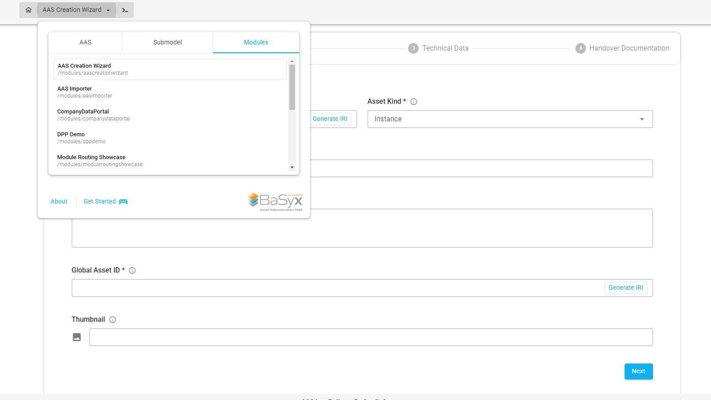

# Modules

> **As a** BaSyx AAS Web UI user  
> **I want to** access additional tools and workflows provided by the Web UI  
> **so that** I can perform tasks such as creating, importing, and managing Asset Administration Shell related data directly from the user interface.

## Feature Overview

Modules extend the functionality of the BaSyx AAS Web UI beyond the standard AAS and Submodel views.

While plugins are primarily used to provide specialized visualizations and interactions for particular Submodels or SubmodelElements, **modules provide standalone application functionality and workflows** within the Web UI.

Modules can be accessed through the main navigation menu.

To open a module:

1. Open the navigation menu in the BaSyx AAS Web UI.
2. Select the **Modules** tab.
3. Select the required module.

The available modules depend on the configuration and version of the BaSyx AAS Web UI.


---

## Available Modules

### AAS Creation Wizard

The **AAS Creation Wizard** provides a guided workflow for creating an Asset Administration Shell together with associated standardized Submodels.

The wizard currently guides the user through the creation of:

- Asset Information
- Digital Nameplate
- Technical Data
- Handover Documentation

The Submodel forms are based on the corresponding IDTA Submodel Templates.

After completing the wizard, the Asset Administration Shell and its associated Submodels are created and the Submodels are referenced by the AAS.

For more information, see the [AAS Creation Wizard](modules/aas_creation_wizard.md).

---

### AAS Importer

The **AAS Importer** allows an Asset Administration Shell to be transferred from a source AAS infrastructure to a configured destination infrastructure.

An AAS can be identified using either:

- **Asset ID**
- **AAS ID**

The user can select the source infrastructure from which the AAS should be retrieved and the destination infrastructure to which it should be imported.

Depending on the configured infrastructure, the importer can retrieve the AAS together with its associated:

- Submodels
- Concept Descriptions

and upload them to the configured destination infrastructure.

The module also provides options for using AAS Superpath endpoints when accessing Submodels.

```{note}
The available source and destination infrastructures depend on the configuration of the BaSyx AAS Web UI.
```

---

### Company Data Portal

The **Company Data Portal** provides a structured interface for entering and managing information related to a company.

The portal separates company information into different sections, including:

- **Company Identification**
- **Bank Accounts**
- **Digital Interfaces**
- **Business Report Figures**
- **Company Governance**

The individual sections provide forms for entering the corresponding company information.

For example, the **Company Identification** section contains information such as:

- Company name
- Company logo
- Company description
- Homepage URL
- VAT number
- Tax number

Where applicable, multilingual values can also be entered.


---

### DPP Demo

The **DPP Demo** is a module for demonstrating Digital Product Passport related functionality within the BaSyx AAS Web UI.

It can be accessed from the **Modules** section of the navigation menu.

```{note}
The DPP Demo is primarily intended as a demonstration module. Its available functionality may depend on the corresponding Web UI configuration and demo environment.
```

---

### Module Routing Showcase

The **Module Routing Showcase** demonstrates the integration and routing of custom modules within the BaSyx AAS Web UI.

It is primarily intended as an example or development-oriented module for demonstrating how module-specific views can be integrated into the Web UI navigation.

```{note}
This module is mainly relevant for development and demonstration purposes rather than regular AAS management workflows.
```

---

## Modules and Plugins

Modules and plugins provide different types of extensions to the BaSyx AAS Web UI.

| Feature | Modules | Plugins |
| --- | --- | --- |
| Purpose | Provide standalone tools and workflows | Provide specialized visualization and interaction for AAS elements |
| Access | Modules section in the main navigation | Visualization view of a Submodel or SubmodelElement |
| Context | Can operate independently of a currently selected Submodel | Usually associated with a specific Semantic ID |
| Examples | AAS Creation Wizard, AAS Importer, Company Data Portal | Digital Nameplate, Time Series Data, Technical Data |

Modules are therefore suitable for functionality that represents a complete workflow or application, while plugins are typically used to enhance the visualization or interaction with specific AAS data.

---

## Accessing Modules

Modules can be opened through the main navigation selector.

Select the **Modules** tab to display all available modules.


Selecting a module opens the corresponding application view inside the BaSyx AAS Web UI.

```{note}
Only modules that are enabled and available in the current Web UI configuration are displayed.
```

---

## Detailed Module Documentation

Detailed documentation is available for selected modules:

```{toctree}
:maxdepth: 1

modules/aas_creation_wizard
```