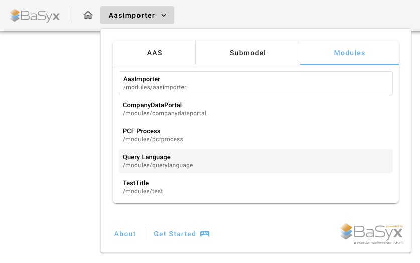
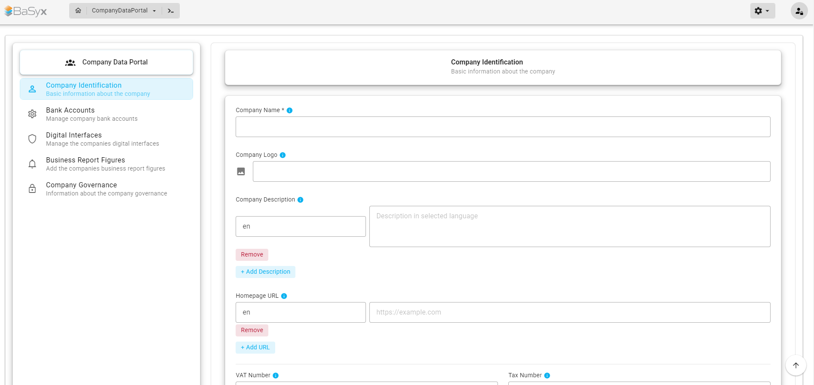
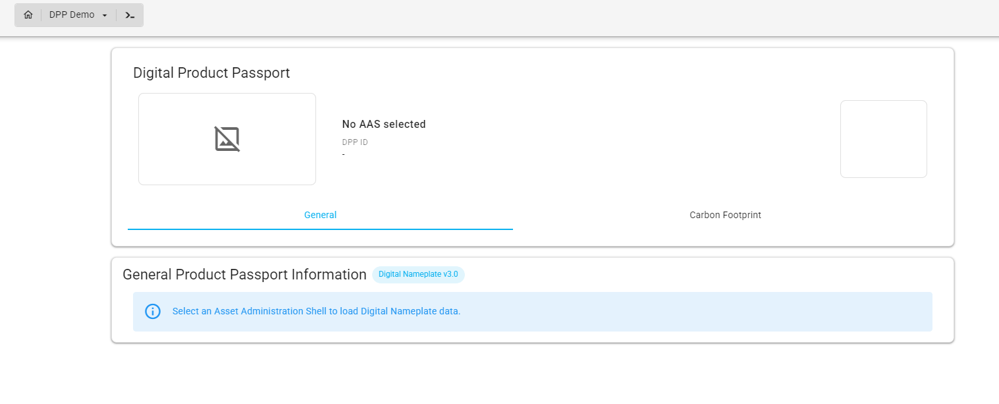
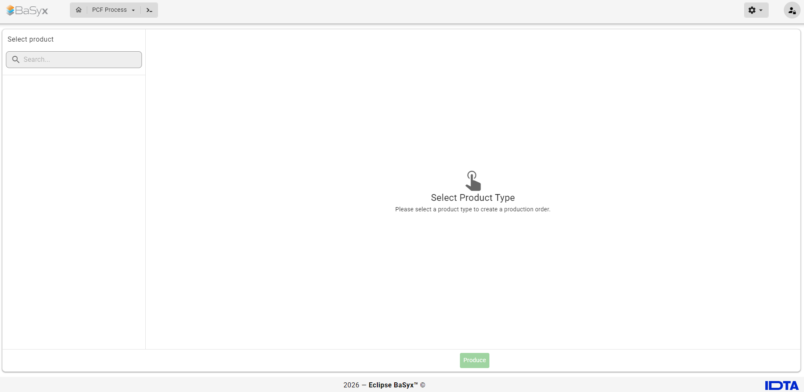
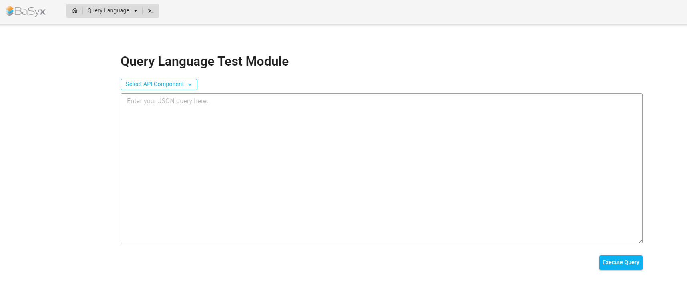

# Modules

> **As a** BaSyx AAS Web UI user  
> **I want to** access additional tools and workflows within the Web UI  
> **so that** I can perform domain-specific and cross-cutting AAS tasks through a unified user interface.

## Feature Overview

Modules extend the BaSyx AAS Web UI with **application-level functionality for specific use cases and workflows**.

A module can provide its own pages, forms, dashboards, navigation, and business logic while still being integrated into the common BaSyx AAS Web UI.

Typical use cases for modules include:

- Importing or transferring Asset Administration Shells
- Creating Asset Administration Shells and Submodels
- Working with information from multiple Submodels
- Providing guided workflows and forms
- Providing domain-specific dashboards or applications

Modules are particularly suited for functionality that goes beyond the visualization or interaction with a single Submodel or SubmodelElement.

```{hint}
A module could also be implemented as a standalone application. Within the BaSyx AAS Web UI, modules are integrated into the common platform to provide a unified user experience.

This provides two main advantages:

- **Consistency**: Modules share the common Web UI structure, navigation, appearance, and available platform services.
- **Extensibility**: Additional domain-specific functionality can be integrated as modules without changing the basic user experience of the Web UI.
```

---

## Accessing Modules

Modules can be accessed through the main navigation menu of the BaSyx AAS Web UI.

The navigation menu contains separate sections for:

- **AAS** – functionality related to Asset Administration Shells
- **Submodel** – functionality related to Submodels and SubmodelElements
- **Modules** – additional application-level tools and workflows

To open a module:

1. Open the main navigation menu.
2. Select the **Modules** tab.
3. Select the desired module.



Selecting a module opens its corresponding application view inside the BaSyx AAS Web UI.

```{note}
The available modules may differ depending on the Web UI configuration, selected infrastructure, current AAS context, authentication, and device.

Therefore, not every module is necessarily visible in every BaSyx AAS Web UI setup.
```

---

## Available Modules

The BaSyx AAS Web UI can contain different modules depending on the configured environment.

The following modules are currently available or included in selected BaSyx AAS Web UI configurations.

### AAS Creation Wizard

The **AAS Creation Wizard** provides a guided workflow for creating an Asset Administration Shell together with associated standardized Submodels.

The wizard currently guides the user through four steps:

1. Asset Information
2. Digital Nameplate
3. Technical Data
4. Handover Documentation

The forms for the individual Submodels are based on the corresponding IDTA Submodel Templates.

After completing the wizard, the Asset Administration Shell and the associated Submodels are created and the corresponding Submodel references are added to the AAS.

For detailed usage instructions, see the [AAS Creation Wizard](modules/aas_creation_wizard.md).

---

### AAS Importer

The **AAS Importer** provides a workflow for transferring an Asset Administration Shell from a source infrastructure to a configured destination infrastructure.

An AAS can be identified using either:

- **Asset ID**
- **AAS ID**

The user can select the source infrastructure from which the AAS should be retrieved and the destination infrastructure to which it should be imported.

When importing an AAS, the module can retrieve and transfer:

- The Asset Administration Shell
- Associated Submodels
- Concept Descriptions, if configured


Additional options are available for using AAS Superpath endpoints when retrieving or storing Submodels.

```{note}
The available source and destination infrastructures depend on the configuration of the BaSyx AAS Web UI.
```

---

### Company Data Portal

The **Company Data Portal** provides a structured interface for entering and managing information related to a company.

Company information is separated into different sections, including:

- **Company Identification**
- **Bank Accounts**
- **Digital Interfaces**
- **Business Report Figures**
- **Company Governance**



The individual sections provide forms for entering the corresponding company information.

For example, the **Company Identification** section contains information such as:

- Company name
- Company logo
- Company description
- Homepage URL
- VAT number
- Tax number

Where supported by the corresponding data structure, multilingual values can also be entered.

---

### DPP Demo

The **DPP Demo** demonstrates Digital Product Passport related functionality within the BaSyx AAS Web UI.

It provides an example of how Digital Product Passport use cases can be integrated as an application-level module within the common Web UI.

```{note}
The DPP Demo is primarily intended for demonstration purposes. Its available functionality may depend on the corresponding Web UI configuration and demo environment.
```

---

### Module Routing Showcase

The **Module Routing Showcase** demonstrates how module-specific views and navigation can be integrated into the BaSyx AAS Web UI.

It is primarily intended as a reference and demonstration module for module navigation and routing capabilities.

```{note}
This module is mainly intended for development and demonstration purposes rather than regular AAS management workflows.
```

---
### PCF Process

The **PCF Process** module provides a workflow for initiating a Product Carbon Footprint (PCF) related production process.

The available product types can be searched and selected from the product list. After selecting a product, the corresponding production process can be started using **Produce**.



```{note}
The available products and functionality of the PCF Process module depend on the configured environment and the underlying AAS data.
```

---

### Query Language

The **Query Language** module provides a test interface for executing queries against AAS-related API components.

The user can:

- Select the API component to query
- Enter a query in JSON format
- Execute the query directly from the Web UI
- Inspect the returned query result

The module can be used to test and interact with the available AAS query functionality without directly calling the corresponding API endpoints.



```{note}
The available API components and supported queries depend on the configured AAS infrastructure.
```
---

## Modules and Plugins

Modules and plugins both extend the functionality of the BaSyx AAS Web UI, but they serve different purposes.

| | Modules | Plugins |
| --- | --- | --- |
| **Purpose** | Provide complete application-level tools and workflows | Provide specialized visualization or interaction for AAS data |
| **Scope** | Can work across multiple Submodels, AASs, or services | Usually focused on a particular Submodel or SubmodelElement |
| **Access** | Opened from the **Modules** section of the main navigation | Displayed within the visualization of a Submodel or SubmodelElement |
| **Context** | Can provide independent workflows, forms, dashboards, and navigation | Typically selected automatically based on the Semantic ID of AAS data |
| **Examples** | AAS Creation Wizard, AAS Importer, Company Data Portal | Digital Nameplate, Time Series Data, Technical Data |

In general:

- Use a **plugin** when specialized visualization or interaction is required for a particular Submodel or SubmodelElement.
- Use a **module** when the functionality represents a larger workflow, application, dashboard, or domain-specific use case.

---

## Module Availability

Modules can define requirements that determine whether they are available in the current Web UI context.

For example, a module may require:

- A particular infrastructure configuration
- Certain backend services to be available
- A currently selected AAS or Submodel
- Authentication
- A desktop or mobile environment

As a result, the list shown under **Modules** can vary between different deployments or while navigating through the Web UI.

---

## Developing Custom Modules

The BaSyx AAS Web UI can be extended with additional custom modules.

Custom modules can provide their own application views, workflows, navigation, and integration with shared BaSyx Web UI functionality.

For information about implementing a custom module, see the [Developing Custom Modules](../../../../developer_documentation/basyx_web_ui/developing_custom_modules.md) documentation.

---

## Detailed Module Documentation

Detailed user documentation is available for selected modules:

```{toctree}
:maxdepth: 1

modules/aas_creation_wizard
```